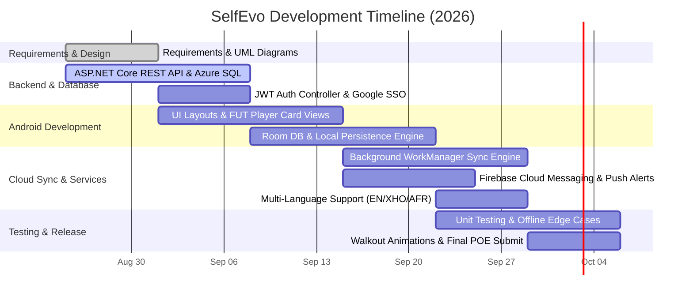

# SelfEvo – Gamified Self-Improvement & Habit Tracker

**Course Module:** OPSC6321 / POE Part 1  
**Target Platform:** Android  
**Tech Stack:** ASP.NET Core REST API, Azure SQL, Android Native (Room DB, Jetpack Compose)

---

## 👥 Team Members
* Dimetri Peters
* Garren Gabron
* Nelson De Vos
* Silindokuhle Gqukani

---

## 🚀 About SelfEvo
**SelfEvo** is a gamified habit-tracking application inspired by FIFA card collection mechanics [cite: 2]. Instead of traditional check-lists, completing daily real-world habits increases your player attributes (Pace, Physical, Skill, etc.) [cite: 2]. Increasing your attributes raises your overall rating (OVR) and unlocks card tiers from Bronze to Special Walkout cards [cite: 2].

---

## ✨ Key Features
* **Authentication & Google SSO:** Encrypted password authentication and Google Single Sign-On [cite: 2].
* **FUT-Style Card Progression:** Dynamic overall rating (OVR) calculations across Bronze, Silver, Gold, and Walkout tiers [cite: 2].
* **Offline-First Sync:** Habit logging works offline via Room Database and automatically syncs to the REST API when online [cite: 2].
* **Push Notifications:** Firebase Cloud Messaging (FCM) integration for daily habit reminders and level-up alerts [cite: 2].
* **Multi-Language Support:** Localized UI for English, isiXhosa, and Afrikaans [cite: 2].

---

## 🛠 Tech Stack & Architecture

* **Mobile Client:** Android Native, Jetpack Compose / UI Views, Room DB, WorkManager, Firebase SDK [cite: 2].
* **Backend:** ASP.NET Core REST API (Azure App Service / SmarterASP) [cite: 2].
* **Database:** Azure SQL Database (Cloud) & Room Database (Local Client) [cite: 2].

---

## 📡 Core API Endpoints

| Method | Endpoint | Description |
| :--- | :--- | :--- |
| `POST` | `/api/auth/register` | Register new user account [cite: 2] |
| `POST` | `/api/auth/login` | Authenticate credentials & return JWT access token [cite: 2] |
| `POST` | `/api/auth/sso` | Validate Google OAuth token [cite: 2] |
| `GET` | `/api/habits` | Fetch user habits and completion flags [cite: 2] |
| `POST` | `/api/habits/log` | Submit habit completion & calculate stat increases [cite: 2] |
| `GET` | `/api/card` | Retrieve active player card stats & OVR rating [cite: 2] |
| `POST` | `/api/sync` | Sync offline local database queue with cloud storage [cite: 2] |

---

## 📅 Project Timeline

